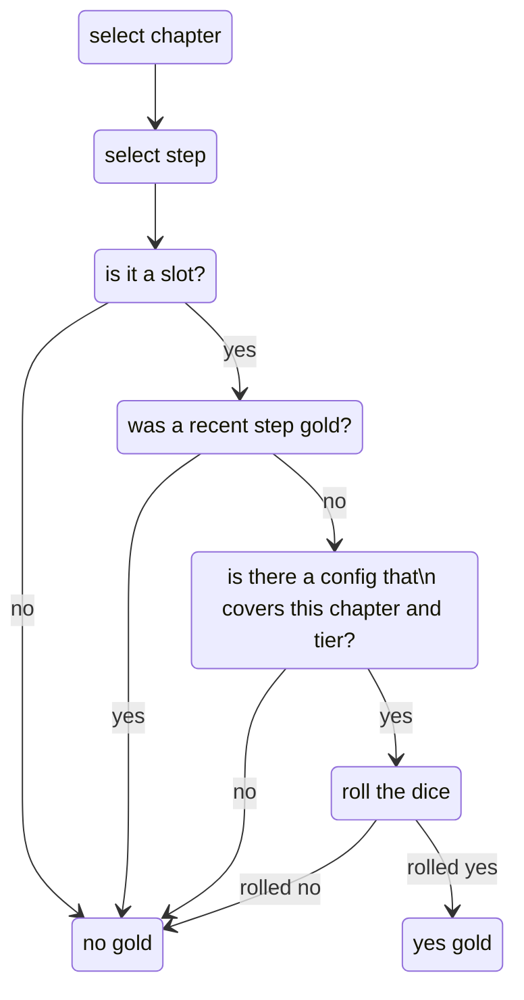

```mermaid
stateDiagram-v2
  step_is_slot : is it a slot?
  step0 : select chapter
  step1 : select step
  step_check_cfg : is there a config that\n covers this chapter and tier?
  step5 : was a recent step gold?
  step_roll_dice : roll the dice
  result_yes_gold : yes gold
  terminal_no : no gold
  step0 --> step1
  step1 --> step_is_slot
  step_is_slot --> terminal_no: no
  step_is_slot --> step5 : yes
  step5 --> terminal_no : yes
  step5 --> step_check_cfg : no
  step_check_cfg --> terminal_no : no
  step_check_cfg --> step_roll_dice : yes
  step_roll_dice --> terminal_no : rolled no
  step_roll_dice --> result_yes_gold : rolled yes

```

